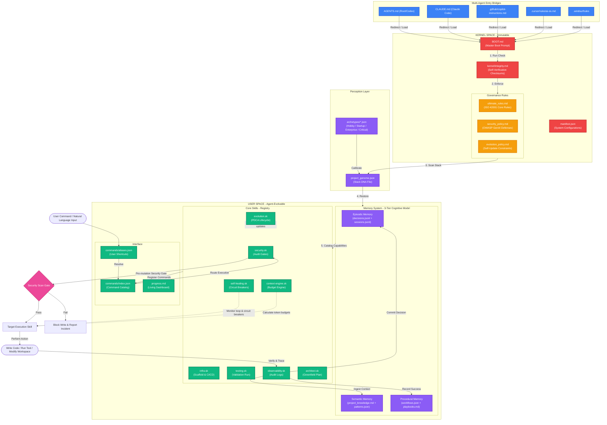

# GoliathOS

GoliathOS is a standards-driven, microkernel-inspired Operating System layer designed to run directly inside your project workspaces. It governs, secures, and enhances AI coding agents (such as Claude Code, Antigravity/Gemini, GitHub Copilot, Cursor, and Windsurf) in any codebase.

---

## 🚀 Key Features

*   **Microkernel Architecture**: Strict separation between the kernel space (immutable governance, rules, configuration) and user space (evolvable skills, memory, commands).
*   **Flexible Agent Delegation**: The primary agent acts as a Coordinator that can edit code directly, but can also delegate complex, multi-file architectures to specialized subagents if the host environment supports it.
*   **Cognitive Security Gates**: No blind regex scanners. The OS enforces a strict pre-mutation cognitive security review, leveraging the LLM's natural reasoning to spot injection flaws, leaked credentials, and unsafe functions before writing to disk.
*   **Pragmatic Self-Healing**: Instead of pretending to run background daemon scripts, the OS uses cognitive loop detection and troubleshooting checklists to break out of failure cycles and find root causes.
*   **Perception & Stack Discovery**: The OS can actively profile your workspace (via `OS_COMMAND INFRA_DISCOVER`) to detect tech stack drift, map sub-modules, and automatically synthesize new semantic rules or custom skills based on what it finds.
*   **Idea-to-Code Scaffolding**: Integrated `Architect` skill that guides greenfield ideas from structured interview to architecture planning, code scaffolding, and environment config.
*   **Native IDE Absorption**: Bridges natively with your IDE's customization systems (like `.agents/skills.json` and `AGENTS.md`) to guarantee that OS skills and semantic memory are absorbed immediately into the agent's context window.
*   **Three-Tier Cognitive Memory**: Maintains Episodic (what happened), Semantic (what we know), and Procedural (how we do things) memory across chat sessions via persistent markdown and JSON logs, preventing agent amnesia.

---

## 📊 System Architecture



---

## 📂 Directory Layout

### 1. Before Install (The Downloaded Package)
```
goliath-os/
├── .ai-os/                          # The OS Kernel (Copy this to your project)
├── .ai-os-installer/                # The Agentic Installer (Copy this to your project)
│   ├── INSTALL_PROMPT.md            # The script you feed to your AI
│   └── templates/                   # Bridge file templates (CLAUDE.md, etc.)
└── README.md
```

### 2. After Install (Your Workspace)
```
your-project/
├── .ai-os/                          
│   ├── BOOT.md                      # Master boot prompt
│   ├── manifest.json                # Project config & metadata
│   ├── kernel/                      # System self-verification checks
│   ├── rules/                       # ISO 42001 rules & OWASP safety policy
│   ├── genome/                      # Detected stack DNA & Archetypes
│   ├── memory/                      
│   │   ├── episodic/                # decisions.jsonl + sessions.jsonl
│   │   ├── semantic/                # project_knowledge.md + patterns.json
│   │   └── procedural/              # workflows.json + playbooks.md
│   ├── agents/                      # Custom specialized agent profiles
│   └── registry/                    # Skill catalogs (.sk/)
│
├── .gitignore                       # (Updated by installer to ignore OS noise)
├── src/                             # (Your actual app code)
│
└── [Bridge File]                    # (Merged by the installer)
    ├── CLAUDE.md                    # ...if using Claude Code
    ├── .windsurfrules               # ...if using Windsurf
    ├── .cursor/rules/ai-os.md       # ...if using Cursor
    └── .agents/AGENTS.md            # ...if using Antigravity/Gemini
```

---

## ⚙️ How to Install & Use

1. Copy the `.ai-os/` and `.ai-os-installer/` directories into your project root.
2. Open your project in your AI editor or launch your terminal assistant.
3. Open your AI chat and type: **"Please install the AI OS using the instructions in `.ai-os-installer/INSTALL_PROMPT.md`"**
4. The agent will act as an installer. It will safely merge the necessary bridge instructions into your existing rules (e.g., `.windsurfrules`, `CLAUDE.md`) without destroying them, clean up the installer directory, and boot up!

---

## 🔄 How to Update

To update an existing workspace to the latest version of GoliathOS while preserving your agent's learned memory and custom configurations:

1. **Update Kernel & Rules**: Copy the latest `.ai-os/BOOT.md`, `.ai-os/kernel/`, and `.ai-os/rules/` directories into your project's `.ai-os/` folder.
2. **Update Core Skills**: Copy the latest `.ai-os/registry/` directory to update the default system skills.
3. **Preserve User Space**: 
   *   Do **NOT** overwrite the `.ai-os/memory/` directory (this keeps your agent's episodic, semantic, and procedural memory intact).
   *   Merge any new configuration keys into your existing `.ai-os/manifest.json` instead of replacing it entirely.

---

## 🏎️ Efficient Workflow

How to get the most out of GoliathOS in your daily development:

1. **The Boot**: When you start your day, let the agent initialize. It will read `BOOT.md`, load the rules, and absorb the semantic memory (`project_knowledge.md`).
2. **Daily Development**: Code normally! You don't need to micromanage the OS. Just ask your agent to build features, fix bugs, or write tests. The OS's security and architecture rules govern it silently in the background.
3. **Complex Planning**: If you have a massive architectural change, don't just tell the agent to code. Type `> OS_COMMAND plan`. The `Architect` skill will engage in a structured interview with you to design the feature safely.
4. **End of Session Consolidation**: Before you close your IDE for the day, tell the agent: **"Wrap up and consolidate memory."** The agent will analyze everything you did today, extract architectural rules, and save them to `project_knowledge.md` so it never suffers from amnesia tomorrow!

---

## 💾 Backup & Restore (Portability)

Because GoliathOS stores all of its memory, skills, and governance in plain-text markdown and JSON files within your workspace, **the OS state travels with your code**.

- **To Backup**: Simply commit the `.ai-os/` directory to your project's Git repository.
- **Merge Conflicts?**: 
  - *Append-only Logs (`decisions.jsonl`)*: Git naturally auto-merges append-only logs very well.
  - *Semantic Memory (`project_knowledge.md`)*: If two agents learn conflicting architectural rules on different branches, Git will throw a merge conflict. **This is a feature, not a bug!** It forces the human developers to reconcile conflicting AI architectures just like conflicting code.
  - *Noisy Files*: The Agentic Installer automatically adds noisy, high-frequency files (like `sessions.jsonl` and `progress.md`) to your `.gitignore` to prevent conflict hell.
- **To Restore**: When you clone your repo on a new laptop (or a teammate clones it), the host AI agent will instantly absorb the exact same episodic memories, architectural rules, and custom skills the moment they open the project! There are no hidden databases or cloud states to sync.

---

## 🛠️ Command Interface

Once booted, you can direct the agent using standard commands or aliases in your chat window:

```
> OS_COMMAND STATUS           # Show system health & stats
> OS_COMMAND HELP             # View all available pragmatic commands
> OS_COMMAND audit            # Run full cognitive security scan
> OS_COMMAND fix              # Run troubleshooting checklist to break out of loops
> OS_COMMAND plan --idea="..." # Kick off greenfield planning interview
> OS_COMMAND discover         # Profile workspace to detect tech stack and modules
> OS_COMMAND wrap             # Log recent decisions and consolidate semantic memory
```

---

*GoliathOS v1.0.0 — An operating system for the next generation of AI developers.*
