# MaiKS

MaiKS is a microkernel-inspired governance layer that runs inside your project workspace. It applies rules, a pre-write security check, and persistent memory to AI coding agents (Claude Code, Antigravity/Gemini, GitHub Copilot, Cursor, Windsurf) working in your codebase.

> **Deterministic, Git-Native Memory**
> Instead of a vector database (RAG), MaiKS stores memory as plain Markdown and JSON files alongside your code, organized as a Hub (global project knowledge) and Spokes (per-branch task notes). When someone clones the repo, their AI reads the same project knowledge, decision history, and custom skills — no external database required.

---

## Key Features

*   **Microkernel Structure**: Separation between kernel space (rules, configuration) and user space (skills, memory, commands).
*   **PDCA Self-Evolution**: A Plan-Do-Check-Act lifecycle. If the AI finds a more efficient pattern, it can propose and apply upgrades to its own workflows and skills, with rollback if integrity checks fail.
*   **Flexible Agent Delegation**: The primary agent acts as a coordinator that can edit code directly, or delegate complex, multi-file work to specialized subagents if the host environment supports it.
*   **Pre-Mutation Security Checklist**: A security review runs before any code is written to disk, checking for hardcoded credentials, injection patterns, and unsafe functions. This isn't a substitute for a dedicated SAST tool (Semgrep, Snyk, etc.) in CI.
*   **Self-Healing**: Loop detection breaks out of repeated-failure cycles. When the AI fixes a non-trivial issue, it prompts you to extract the fix into a permanent playbook so the same error doesn't need re-diagnosing next time.
*   **Perception & Stack Discovery**: Can profile your workspace (via `OS_COMMAND INFRA_DISCOVER_MODULES`) to detect tech stack drift, map sub-modules, and generate new semantic rules or custom skills based on what it finds.
*   **Idea-to-Code Scaffolding**: An `Architect` skill that walks greenfield ideas through a structured interview to a project plan, code scaffolding, and environment config.
*   **IDE Bridge Files**: Hooks into your IDE's customization system (`.agents/skills.json`, a root `AGENTS.md`, plus host-specific files like `CLAUDE.md` and Cursor's `.mdc` rules) so skills and memory are loaded into the agent's context — each bridge file carries a self-sufficient minimum contract even on hosts that never run the full boot sequence.
*   **Four-Tier Memory Model**: Reduces cross-session context loss by maintaining Episodic (decisions), Semantic (project structure), Task (active branch), and Procedural (executable playbooks) memory.
*   **Hub and Spoke Task Memory**: When you switch to a feature or bugfix branch, working memory is isolated into a dedicated task file, keeping the global project knowledge file free of branch-specific noise.
*   **Verified Memory Promotion**: Task notes are deliberately unscrutinized working memory — half-formed ideas and dead ends are expected. Before anything gets promoted into permanent, cross-session semantic memory, it's checked two ways: is the claim still factually true against the current code, *and* was the underlying change actually accepted (not still buggy, mid-revision, or awaiting your sign-off)? A description of a bug that's still in the code is a true statement and a bad thing to remember as "how it works."

## Token Economics

**"Won't reading the entire framework on every boot cost a fortune in tokens?"**

It would — so the OS doesn't do that. `BOOT.md` is a small hot core (~4,000 tokens as measured) that carries a condensed rules digest and *pointers* to the full rules, skill procedures, and command catalog, rather than inlining them. Boot reads six small files — `BOOT.md`, `manifest.json`, `project_genome.json`, your active archetype file, a single-entry session-continuity summary, and the currently-open task memory file (`memory/tasks/*.md` — `BOOT.md` §2 step 4 requires one every session, including on `main`) — and stops there. The full text of `rules/*.md`, `registry/*/SKILL.md`, and `commands/index.json` (tens of KB combined) loads only when a specific situation actually calls for it: a rule conflict, a security-sensitive change, or a command being invoked.

Net effect: boot costs roughly **4,500–5,000 tokens** (the task file's size is the one variable component) regardless of how much governance content the framework has accumulated, since new rules and skills live in files that are opt-in by trigger, not opt-out by size. Provider-side context caching (Claude, Gemini, GPT-4o, etc.) still helps on top of this for the parts that are read repeatedly, but it's a bonus, not the mechanism the design relies on.

---

## System Structure

```mermaid
graph TB
    %% Styling Definitions
    classDef bridge fill:#3b82f6,stroke:#1d4ed8,stroke-width:2px,color:#fff;
    classDef kernel fill:#ef4444,stroke:#b91c1c,stroke-width:2px,color:#fff;
    classDef governance fill:#f59e0b,stroke:#d97706,stroke-width:2px,color:#fff;
    classDef userspace fill:#10b981,stroke:#047857,stroke-width:2px,color:#fff;
    classDef database fill:#8b5cf6,stroke:#6d28d9,stroke-width:2px,color:#fff;
    classDef gate fill:#ec4899,stroke:#be185d,stroke-width:2px,color:#fff;

    %% Entry Bridges
    subgraph MultiAgentBridges ["Multi-Agent Entry Bridges (each carries a self-sufficient fallback contract)"]
        direction LR
        AG["AGENTS.md (Root, cross-tool)"]:::bridge
        CL["CLAUDE.md (Claude Code)"]:::bridge
        CO[".github/copilot-instructions.md"]:::bridge
        CU[".cursor/rules/ai-os.mdc"]:::bridge
        WI[".windsurfrules"]:::bridge
    end

    %% Kernel Space
    subgraph KernelSpace ["KERNEL SPACE - Immutable by convention (R3; self-restraint, not a technical control)"]
        BOOT["BOOT.md<br>(Hot-core Boot Prompt, ~4K tokens)"]:::kernel
        MANIFEST["manifest.json<br>(System Configurations)"]:::kernel
        INTEGRITY["kernel/integrity.md<br>(Structural Self-Checks, no checksum)"]:::kernel
        BOOTSTRAP["kernel/bootstrap.md<br>(First-Boot Wizard, loaded once ever)"]:::kernel
        
        subgraph GovernanceRules ["Governance Rules (loaded on-demand, not at boot)"]
            RULES["ultimate_rules.md<br>(Governance Rules)"]:::governance
            SECPOL["security_policy.md<br>(OWASP GenAI Defenses)"]:::governance
            EVOPOL["evolution_policy.md<br>(Self-Update Constraints)"]:::governance
        end
    end

    %% Perception Layer
    subgraph PerceptionLayer ["Perception Layer"]
        GENOME["project_genome.json<br>(Stack DNA File)"]:::database
        ARCHETYPES["archetypes/*.json<br>(Hobby / Startup / Enterprise / Critical)"]:::database
    end

    %% User Space
    subgraph UserSpace ["USER SPACE - Agent-Evolvable"]
        direction TB
        
        subgraph MemorySystem ["Memory System - Structured Files"]
            EPISODIC["Episodic Memory<br>(decisions.jsonl + sessions.jsonl<br>+ last_session.json, decisions.archive.jsonl)"]:::database
            SEMANTIC["Semantic (Hub)<br>(project_knowledge.md index<br>+ knowledge/*.md sub-files)"]:::database
            TASK["Task (Spokes)<br>(tasks/ + archived_tasks/,<br>orphan-swept & pruned)"]:::database
            PROCEDURAL["Procedural Memory<br>(workflows.json + playbooks.md)"]:::database
        end

        subgraph CoreSkills ["Core Skills - Registry"]
            SEC_SK["security.sk<br>(Audit Gates)"]:::userspace
            INF_SK["infra.sk<br>(Scaffold & CI/CD)"]:::userspace
            TST_SK["testing.sk<br>(Validation Run)"]:::userspace
            EVO_SK["evolution.sk<br>(PDCA Lifecycle)"]:::userspace
            OBS_SK["observability.sk<br>(Audit Logs)"]:::userspace
            CTX_SK["context-engine.sk<br>(Relevance & Selection)"]:::userspace
            MEM_SK["memory.sk<br>(Verify + Accept-Gate Promotion)"]:::userspace
            HEAL_SK["self-healing.sk<br>(Loop Detection & Repair)"]:::userspace
            ARC_SK["architect.sk<br>(Greenfield Plan)"]:::userspace
            PLAN_SK["planning.sk<br>(In-Project Brainstorm/Plan/Execute)"]:::userspace
            DEVLOOP_SK["dev-loop.sk<br>(Implement + Peer Review)"]:::userspace
            SIMP_SK["simplicity.sk<br>(Ladder + Over-Engineering Review)"]:::userspace
        end

        subgraph Interface ["Interface"]
            CMD_REG["commands/index.json<br>(Command Catalog)"]:::userspace
            ALIASES["commands/aliases.json<br>(User Shortcuts)"]:::userspace
            SHELL["progress.md<br>(Living Dashboard)"]:::userspace
        end
    end

    %% Boot Redirection Flow
    AG & CL & CO & CU & WI -->|Redirect / Load| BOOT

    %% Initialization Sequence (~4.5-5K tokens, 6 small files — see Token Economics)
    BOOT -->|1. Skim Rules Digest, inline| GENOME
    ARCHETYPES -->|Calibrate one archetype| GENOME
    GENOME -->|2. Read last_session.json only - single-file lookup| EPISODIC
    GENOME -->|3. Task branch? load/create tasks/*.md| TASK
    BOOT -.->|On-demand: conflict, security decision, or evolution| GovernanceRules
    BOOT -.->|On-demand: something looks broken| INTEGRITY
    BOOT -.->|First boot only, once ever| BOOTSTRAP
    BOOT -.->|On-demand: command invoked| CMD_REG

    %% Runtime Invocation Loop
    input([User Command / Natural Language Input]) --> ALIASES
    ALIASES -->|Resolve, or match closest command silently| CMD_REG
    CMD_REG -->|Route Execution| SEC_SK
    
    SEC_SK -->|Pre-mutation Security Gate| ScanGate{"Security Scan Gate"}:::gate
    ScanGate -->|Fail| BlockResponse["Block Write & Report Incident"]
    ScanGate -->|Pass| TargetSkill["Target Execution Skill"]

    %% Action Loop Details
    TargetSkill -->|Perform Action| Action(["Write Code / Run Tool / Modify Workspace"])
    Action -->|Verify & Trace| OBS_SK
    OBS_SK -->|Commit Decision| EPISODIC
    OBS_SK -->|Record Success| PROCEDURAL
    TASK -->|TASK_CLOSE / MEMORY_CONSOLIDATE| MEM_SK
    MEM_SK -->|Verify facts + accept-gate R15/R21, then promote| SEMANTIC
    
    %% Resilience
    HEAL_SK -.->|Detect loops & run checklists| TargetSkill
    EVO_SK -.->|Propose & verify self-updates| CoreSkills
    CTX_SK -.->|Score relevance for what to read| TargetSkill
```



---

## Installation & Upgrade Guide

### Package Layout (Before Install)
The downloaded/cloned package lives anywhere on your machine — not inside your project.
```
maiks/
├── .ai-os/                          # The OS Kernel
├── .ai-os-installer/                # The Agentic Installer
│   ├── INSTALL_PROMPT.md            # The script you feed to your AI for first install
│   ├── UPDATE_PROMPT.md             # The script you feed to your AI for upgrading
│   └── templates/                   # Bridge file templates (CLAUDE.md, etc.)
└── README.md
```

### First-Time Installation
1. Download or clone MaiKS anywhere on your machine — it does **not** need to be inside your project. Leave it where it downloaded.
2. Open your project in your AI editor or launch your terminal assistant.
3. Open your AI chat and type: **"Please install the AI OS using the instructions in `<path-to-downloaded-package>/.ai-os-installer/INSTALL_PROMPT.md`"**
4. The agent acts as an installer: it copies just the `.ai-os/` folder into your project as its first step, merges the necessary bridge instructions into your existing rules (e.g., `.windsurfrules`, `CLAUDE.md`) without destroying them, and boots up. `.ai-os-installer/` is never copied in, so there's nothing to clean up afterward.
5. On first boot, the OS notices `manifest.json` is unpopulated and runs the **First-Boot Wizard** — it asks for your project name and runs a perception scan (`INFRA_DETECT_STACK`) to map your tech stack.

Once installed, your workspace looks like this:
```
your-project/
├── .ai-os/                          
│   ├── BOOT.md                      # Master boot prompt
│   ├── manifest.json                # Project config & metadata
│   ├── progress.md                  # Living dashboard & status tracker
│   ├── kernel/                      # System self-verification checks
│   ├── rules/                       # ISO 42001 rules & OWASP safety policy
│   ├── commands/                    # User aliases and command catalog
│   ├── genome/                      # Detected stack DNA & Archetypes
│   ├── memory/                      
│   │   ├── episodic/                # decisions.jsonl, sessions.jsonl, last_session.json,
│   │   │                            # decisions.archive.jsonl (rotated on consolidation)
│   │   ├── semantic/                # project_knowledge.md (index) + knowledge/*.md + patterns.json
│   │   │                            # + generated/ (regenerable caches, e.g. dataflow_map.json)
│   │   ├── procedural/              # workflows.json + playbooks.md
│   │   ├── tasks/                   # Active Jira/feature branch working memory
│   │   └── archived_tasks/          # History of closed tasks (pruned, not unbounded)
│   ├── agents/                      # Custom specialized agent profiles
│   └── registry/                    # Skill catalogs (.sk/), incl. core.memory.sk
│
├── .gitignore                       # (Updated by installer to ignore OS noise)
├── src/                             # (Your actual app code)
│
├── AGENTS.md                        # Root bridge — universal fallback, always added
└── [Host-Specific Bridge File]      # (Merged by the installer)
    ├── CLAUDE.md                    # ...if using Claude Code
    ├── .windsurfrules               # ...if using Windsurf
    ├── .cursor/rules/ai-os.mdc      # ...if using Cursor (alwaysApply: true frontmatter)
    ├── .github/copilot-instructions.md # ...if using GitHub Copilot
    └── .agents/AGENTS.md            # ...if using Antigravity/Gemini
```

### Upgrading
**WARNING**: Do **not** overwrite your existing `.ai-os/` folder manually — doing so will wipe out your AI's memory.

1. Download the new version of MaiKS and place the unzipped folder in your workspace (e.g., `./maiks-update`).
2. Open your AI chat and type: **"Please update my AI OS using the instructions in `./maiks-update/.ai-os-installer/UPDATE_PROMPT.md`"**
3. The agent acts as a safe updater: it copies the new kernel, rules, and skills, while guarding your `memory/` folder so it isn't overwritten, and merges any new settings into your `manifest.json`.

---

## Efficient Workflow

How to get the most out of MaiKS in your daily development:

1. **The Boot**: While the bridge files naturally instruct the agent to read `.ai-os/BOOT.md` in the background, LLMs don't always act until spoken to. Begin your first chat of the day with: **`> OS_COMMAND BOOT`** to ensure a verified load of your project's memory.
2. **Branch Auto-Detection (Zero Setup)**: Start a new ticket by checking out a branch (e.g., `git checkout -b feature/JIRA-123`). The OS will automatically detect this branch and create a dedicated, isolated task memory file (`tasks/feature_JIRA-123.md`). It will use this file to log deep technical debugging steps so your main project memory isn't polluted — and it'll do the same even if you work directly on `main`/`release` (solo projects, hotfixes, trunk-based workflows). There's no branch where working notes are allowed to skip straight to permanent project memory unverified; on those protected branches the task file is just *rolling* — periodically drained into `project_knowledge.md` by `MEMORY_CONSOLIDATE` instead of closed all at once by `TASK_CLOSE`. Not in a git repo, or in a detached `HEAD` state with no branch to key off? The OS won't skip task memory or invent a name for you — it checks for an already-open task first, and if it can't find one, it just asks what you're working on before creating the file.
3. **Daily Development**: Code normally! You don't need to micromanage the OS. Just ask your agent to build features, fix bugs, or write tests. The OS's security and design rules govern it silently as it works.
4. **Complex Planning**: If you have a big structural change, don't just tell the agent to code. Which command depends on where you're starting from — the two don't overlap. Starting a whole new idea with no project yet? Type `> OS_COMMAND plan`; the `Architect` skill runs a structured interview through project scaffolding. Already inside this project and planning a feature or fix? Type `> OS_COMMAND feature` (`PLAN_BRAINSTORM`) instead; it clarifies scope through a few rounds of questions, writes a concrete step-by-step plan, then executes it with verification at each step.
5. **Task Completion & Consolidation**: When you finish your feature and are ready to open a Pull Request, tell the agent: **`> OS_COMMAND TASK_CLOSE`** (or just say "summarize and close this task"). The AI reads your task memory, checks each candidate fact two ways — is it still factually accurate, and was the underlying change actually accepted rather than still buggy or awaiting your sign-off — before saving anything to the `semantic/` hub, then archives the task file. Nothing gets promoted to permanent memory just because it was written down.

---

## Backup & Restore (Portability)

MaiKS stores all of its memory, skills, and governance as plain-text Markdown and JSON files within your workspace, so this state travels with your code.

- **To Backup**: Commit the `.ai-os/` directory to your project's Git repository.
- **Merge Conflicts?**:
  - *Append-only Logs (`decisions.jsonl`)*: Git auto-merges append-only logs well.
  - *Semantic Memory (`knowledge/*.md`, indexed by `project_knowledge.md`)*: institutional knowledge is split into topic files to keep concurrent branches from touching the same file. Before deleting something as superseded, it checks Git history first — if another branch added that entry after your branch forked, it flags the conflict instead of silently dropping it on merge. A conflict reaching you is a signal something needs a human look, not intended behavior.
  - *Noisy Files*: The installer adds per-machine files (`sessions.jsonl`, `last_session.json`, and `progress.md`) to your `.gitignore` to reduce merge conflicts — `decisions.jsonl` itself stays tracked, since it's the shared audit trail.
- **To Restore**: When you clone your repo on a new machine (or a teammate clones it), the host AI agent reads the same episodic memories, structural rules, and custom skills. No external database to sync.

---

## Command Reference

MaiKS commands can be invoked with **natural language** — you don't need exact command syntax; the AI matches your request to the closest command.

### Core System
| Command | Alias | Description | Example Prompt |
|---|---|---|---|
| `STATUS` | `status` | Show system health and memory stats | *"Can you check the OS status?"* |
| `HELP` | | View all available pragmatic commands | *"What commands can you run?"* |

### Security & Healing
| Command | Alias | Description | Example Prompt |
|---|---|---|---|
| `SECURITY_AUDIT` | `audit` | Full workspace security review | *"Please audit the workspace before we commit"* |
| `SECURITY_SCAN_FILE` | `scan` | Security review on a specific file | *"Check auth.ts for security flaws"* |
| `HEAL_DIAGNOSE` | `fix` | Run troubleshooting checklist | *"I'm stuck in an error loop, please run a diagnosis"* |
| `HEAL_REPAIR` | `repair` | Execute an auto-repair sequence | *"Go ahead and repair that issue"* |
| `REVIEW_CREDIBILITY` | | Audit docs/claims for overclaims and stale info | *"Review this README for anything that's gone stale"* |

### Planning & Infrastructure
| Command | Alias | Description | Example Prompt |
|---|---|---|---|
| `ARCHITECT_PLAN` | `plan` | Interactive interview to plan a feature | *"Let's plan a new user dashboard feature"* |
| `INFRA_DISCOVER_MODULES` | `discover` | Profile codebase to detect stack drift | *"Profile the codebase, I just added Next.js"* |
| `INFRA_SCAFFOLD` | | Generate boilerplate project structure | *"Scaffold the project structure for me"* |
| `INFRA_ANALYZE_COMMITS` | `absorb_history` | Seed semantic memory from recent PR-merge history | *"Absorb our commit history into project memory"* |
| `INFRA_MAP_DATAFLOW` | `trace` | Trace a field to every place it's read/stored/emitted, or trace a sink back to its inputs | *"Where does the signup email field end up?"* |

### Memory & Evolution
| Command | Alias | Description | Example Prompt |
|---|---|---|---|
| `WRAP` | `wrap` | Pause the session — save continuity, promote nothing | *"Let's stop here for today"* |
| `TASK_CLOSE` | `close` | Execute the Consolidation Protocol | *"I'm done with this branch, summarize and close the task"* |
| `MEMORY_CONSOLIDATE`| `consolidate`| Extract rules into semantic memory | *"Extract the rules we just learned into memory"* |
| `MEMORY_AMEND` | `amend` | Correct or retract a semantic-memory entry that turned out wrong | *"That convention in the docs is actually what caused this bug"* |
| `EVOLVE_PROPOSE` | `propose` | Draft a PDCA system upgrade | *"Propose a new command to automate docker builds"* |
| `EVOLVE_APPLY` | `apply` | Apply an approved evolution | *"That proposal looks good, apply it"* |

### Testing
| Command | Alias | Description | Example Prompt |
|---|---|---|---|
| `TEST_RUN` | `test` | Execute the test suite | *"Run the tests"* |
| `TEST_GENERATE` | | AI-assisted test generation | *"Write some robust tests for this new utility"* |

---

*MaiKS v2.7.0*
